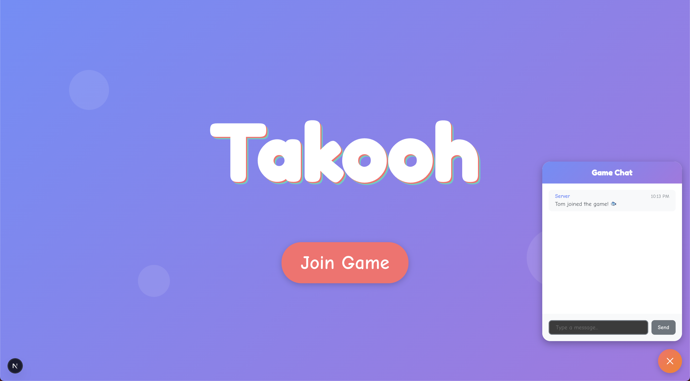
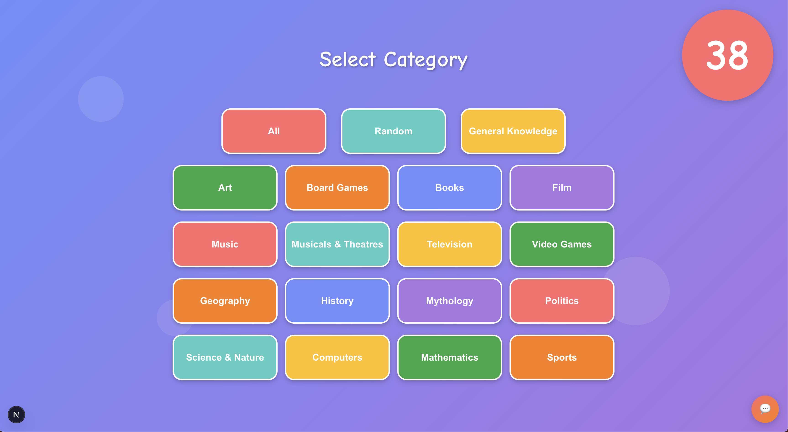
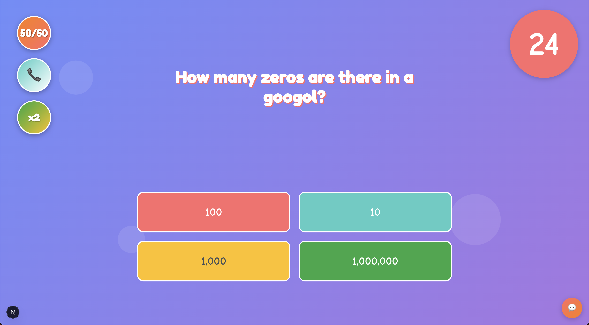
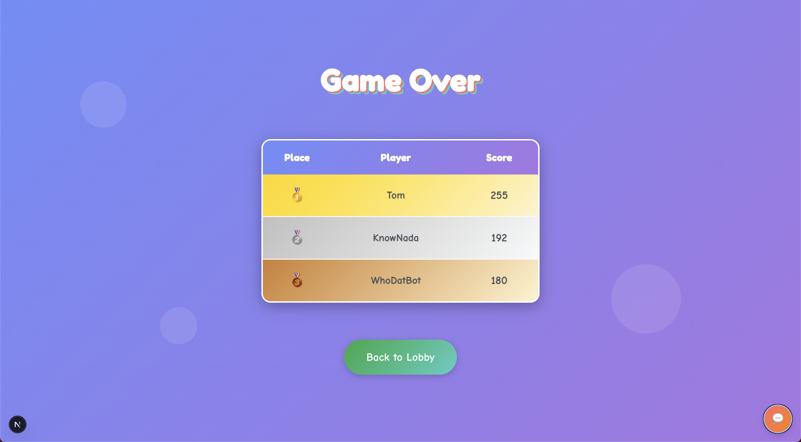

# 🎯 Real-Time Multiplayer Trivia Game

A modern, real-time multiplayer trivia game built with Next.js and Python, featuring intelligent bots, AI-powered assistance, and dynamic gameplay mechanics.


_Players join the lobby and wait for matchmaking_

## 🌟 Features

### 🎮 Core Gameplay

- **Real-time multiplayer**: Up to 4 players compete simultaneously
- **Smart matchmaking**: 30-second lobby system with automatic game creation
- **10 questions per game**: Fast-paced rounds with time pressure
- **Multiple categories**: 19 trivia categories from featuring more than 600 questions
- **Adaptive difficulty**: Questions adjust based on player performance


_Players vote on their preferred trivia category_

### 🤖 Intelligent Bot System

- **Dynamic bot addition**: Single players get paired with 3 AI opponents
- **Three bot difficulty levels**: Novice, Intermediate and Expert


_Choose your bot opponents' difficulty level_

### ⚡ Power-ups & Strategy

- **50/50**: Eliminates two incorrect answers
- **Call a Friend**: AI-powered hint using Google's Gemini API
- **Double Points**: Doubles the score for that question
- **One-time use**: Strategic decision-making required


_Answer questions with strategic power-up usage_

### 🏆 Competitive Elements

- **Time-based scoring**: Faster correct answers earn more points
- **Rankings**: Real-time score updates during gameplay


_Final leaderboard with detailed scoring_

## 🛠️ Technical Architecture

### Backend (Python)

- **FastAPI + Socket.IO**: High-performance async server
- **Event-driven architecture**: Clean separation of concerns
- **SQLite database**: 600+ trivia questions across multiple categories
- **Google Gemini AI**: Powers the "Call a Friend" feature
- **Modular design**: Separate managers for games, players, and lobbies

### Frontend (Next.js)

- **React 19 + TypeScript**: Modern, type-safe development
- **Socket.IO client**: Real-time bidirectional communication
- **App Router**: File-system based routing with dynamic game rooms
- **Component-based UI**: Reusable, maintainable interface components
- **CSS Modules**: Scoped styling for consistent design

### Real-Time Communication

```typescript
// Client events
enum ClientEvent {
  NEW_PLAYER = "new_player",
  JOIN_LOBBY = "join_lobby",
  SUBMIT_ANSWER = "submit_answer",
  USE_POWERUP = "use_powerup",
  MESSAGE = "client_message",
}

// Server events
enum ServerEvent {
  LOBBY_UPDATE = "lobby_update",
  GAME_UPDATE = "game_update",
  NEW_GAME = "new_game",
  MESSAGE = "server_message",
}
```

## 📁 Project Structure

```
itr-3.2/
├── backend/                    # Python FastAPI server
│   ├── main.py                # Application entry point
│   ├── app/
│   │   └── manager.py         # Central application coordinator
│   ├── api/
│   │   └── socket.py          # Socket.IO event handlers
│   ├── game/
│   │   ├── game.py            # Core game logic and phases
│   │   ├── manager.py         # Game lifecycle management
│   │   └── models.py          # Game state models
│   ├── player/
│   │   ├── player.py          # Player models and bot logic
│   │   └── manager.py         # Player lifecycle management
│   ├── lobby/
│   │   └── lobby.py           # Matchmaking and lobby management
│   ├── questions/
│   │   ├── provider.py        # Question delivery system
│   │   ├── models.py          # Question and category models
│   │   └── questions.db       # SQLite database with 600+ questions
│   ├── gemini/
│   │   ├── gemini.py          # Google Gemini AI integration
│   │   └── call_friend.txt    # AI prompt template
│   └── events/
│       ├── events.py          # Event definitions and queue
│       └── data.py            # Event data models
├── frontend/                   # Next.js React application
│   ├── src/
│   │   ├── app/
│   │   │   ├── lobby/         # Lobby page
│   │   │   └── game/[gameId]/ # Dynamic game rooms
│   │   ├── components/
│   │   │   ├── lobby/         # Lobby UI components
│   │   │   ├── game-phases/   # Game state UI components
│   │   │   ├── chat/          # Chat system components
│   │   │   └── countdown/     # Timer components
│   │   └── shared/
│   │       ├── socket/        # Socket.IO client setup
│   │       └── events/        # Event type definitions
│   └── public/                # Static assets
```

## 🎯 Game Flow

### 1. **Lobby Phase**

- Players enter their name and join the lobby
- 30-second countdown begins when first player joins
- Game starts when timer expires

### 2. **Pre-Game Setup**

- Single players choose bot difficulty level
- All players vote on trivia category

### 3. **Question Rounds** (10 total)

- 30 seconds per question
- Multiple choice answers with color-coded buttons
- Power-ups available for strategic use
- Real-time scoring based on speed and accuracy

### 4. **Results & Chat**

- Final leaderboard with detailed scores
- Continuous chat throughout all phases
- Option to start a new game

## 🚀 Getting Started

### Prerequisites

- **Python 3.8+** with pip
- **Node.js 18+** with npm
- **Google Gemini API key** (for Call a Friend feature)

### Backend Setup

1. **Navigate to backend directory**

   ```bash
   cd backend
   ```

2. **Create virtual environment**

   ```bash
   python -m venv .venv
   source .venv/bin/activate  # On Windows: .venv\Scripts\activate
   ```

3. **Install dependencies**

   ```bash
   pip install -r requirements.txt
   ```

4. **Set up environment variables**

   ```bash
   # Create .env file
   echo "GEMINI_API_KEY=your_gemini_api_key_here" > .env
   ```

5. **Start the server**
   ```bash
   python main.py
   ```
   Server runs on `http://localhost:8000`

### Frontend Setup

1. **Navigate to frontend directory**

   ```bash
   cd frontend
   ```

2. **Install dependencies**

   ```bash
   npm install
   ```

3. **Start development server**
   ```bash
   npm run dev
   ```
   Application runs on `http://localhost:3000`

### Quick Start

1. Open `http://localhost:3000` in multiple browser tabs
2. Enter different player names in each tab
3. Join the lobby and wait for matchmaking
4. Enjoy the trivia competition!

## 🔧 Configuration

### Game Settings

Modify `backend/game/models.py` for game timing:

```python
class GamePhase(str, Enum):
    def get_duration(self) -> int:
        match self:
            case GamePhase.CATEGORY_SELECTION: return 45  # seconds
            case GamePhase.AWAITING_ANSWERS: return 30    # seconds
            # ... other phases
```

### Bot Behavior

Adjust bot accuracy in `backend/player/player.py`:

```python
class BotLevel(str, Enum):
    def get_success_rate(self) -> float:
        match self:
            case BotLevel.NOVICE: return 0.2      # 20% accuracy
            case BotLevel.INTERMEDIATE: return 0.4 # 40% accuracy
            case BotLevel.EXPERT: return 0.6      # 60% accuracy
```

**Built with ❤️ for real-time multiplayer gaming**
